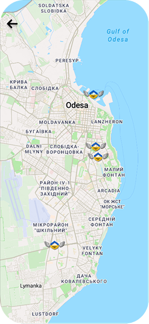
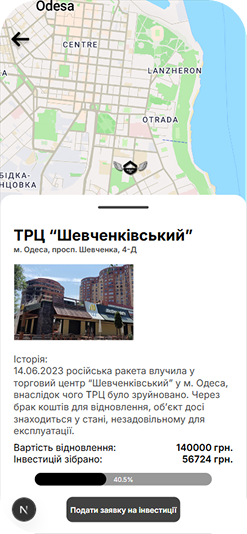
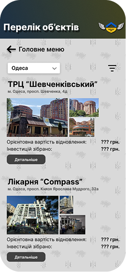
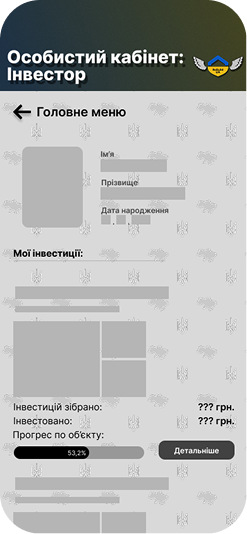

#  ReBuildUa - Reconstruction Platform

**ReBuildUa** is a social impact platform designed to connect international investors, volunteers, and construction companies with reconstruction projects in Ukraine.

🏆 **Finalist at "Fresh Air 2025" Hackathon**
*Built in under 48 hours by a team of 3.*

---

## 💡 The Problem & Solution

**The Challenge:** Coordinating reconstruction efforts requires transparency and easy access to data for investors and volunteers.
**Our Solution:** A mobile-first web application featuring an interactive map that visualizes damaged sites, funding needs, and active construction projects in real-time.

---

## ✨ Key Features

* **🗺️ Interactive Map:** Advanced visualization using **Mapbox GL JS** to pin-point construction sites with custom markers and clusters.
* **📱 Mobile-First Design:** Fully responsive UI built with **TailwindCSS** for seamless experience on field devices.
* **🔍 Smart Filtering:** Filter projects by region, damage type, and required funding.
* **⚡ Real-Time Data:** Dynamic content fetching from the backend API.
* **🎨 Modern UI/UX:** Clean, accessible interface designed for rapid navigation.

---

## 🛠 Tech Stack

* **Frontend:** React.js, TypeScript
* **Styling:** TailwindCSS
* **Maps:** Mapbox GL JS
* **State Management:** React Context API / Hooks

---

## 📸 Screenshots

| Interactive Map | Object Passport | General Register | Personal Account |
|:---:|:---:|:---:|:---:|
|  |  |  |  |

---